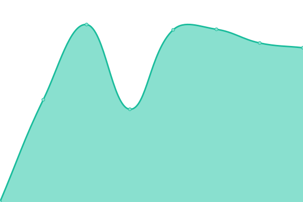
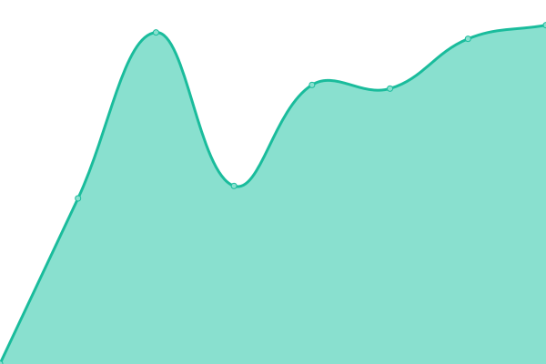

# [📈 Live Status](https://status.lbxs.dev): <!--live status--> **🟩 All systems operational**

This repository contains the open-source uptime monitor and status page for [Upptime](https://upptime.js.org), powered by [Upptime](https://github.com/upptime/upptime).

With [Upptime](https://upptime.js.org), you can get your own unlimited and free uptime monitor and status page, powered entirely by a GitHub repository. We use [Issues](https://github.com/upptime/upptime/issues) as incident reports, [Actions](https://github.com/leoboyerbx/upptime/actions) as uptime monitors, and [Pages](https://status.lbxs.dev) for the status page.

<!--start: status pages-->
<!-- This summary is generated by Upptime (https://github.com/upptime/upptime) -->
<!-- Do not edit this manually, your changes will be overwritten -->
<!-- prettier-ignore -->
| URL | Status | History | Response Time | Uptime |
| --- | ------ | ------- | ------------- | ------ |
|  [Léo Boyer portfolio --> production](www.leoboyer.fr) | 🟩 Up | [leo-boyer-portfolio-production.yml](https://github.com/leoboyerbx/upptime/commits/HEAD/history/leo-boyer-portfolio-production.yml) | 

 798ms
     
 | 

<a href="https://status.lbxs.dev/history/leo-boyer-portfolio-production">100.00%</a>
    

|  [Assets](assets.leoboyer.fr) | 🟩 Up | [assets.yml](https://github.com/leoboyerbx/upptime/commits/HEAD/history/assets.yml) | 

 769ms
     
 | 

<a href="https://status.lbxs.dev/history/assets">100.00%</a>
    

|  [pnkStartpage](start.lbxs.dev) | 🟩 Up | [pnk-startpage.yml](https://github.com/leoboyerbx/upptime/commits/HEAD/history/pnk-startpage.yml) | 

 442ms
     
 | 

<a href="https://status.lbxs.dev/history/pnk-startpage">100.00%</a>
    

|  [pnkStartpage Web servuce](ws.start.lbxs.dev) | 🟩 Up | [pnk-startpage-web-servuce.yml](https://github.com/leoboyerbx/upptime/commits/HEAD/history/pnk-startpage-web-servuce.yml) | 

 766ms
     
 | 

<a href="https://status.lbxs.dev/history/pnk-startpage-web-servuce">100.00%</a>
    

|  [CORSAnywhere proxy instance](cors-proxy.lbxs.dev) | 🟩 Up | [cors-anywhere-proxy-instance.yml](https://github.com/leoboyerbx/upptime/commits/HEAD/history/cors-anywhere-proxy-instance.yml) | 

 667ms
     
 | 

<a href="https://status.lbxs.dev/history/cors-anywhere-proxy-instance">100.00%</a>
    

|  [**Demo website**: hackathon](hackathon.leoboyer.dev) | 🟩 Up | [demo-website-hackathon.yml](https://github.com/leoboyerbx/upptime/commits/HEAD/history/demo-website-hackathon.yml) | 

 800ms
     
 | 

<a href="https://status.lbxs.dev/history/demo-website-hackathon">100.00%</a>
    

|  [**Demo website**: plateformes](plateformes.leoboyer.dev) | 🟩 Up | [demo-website-plateformes.yml](https://github.com/leoboyerbx/upptime/commits/HEAD/history/demo-website-plateformes.yml) | 

 572ms
     
 | 

<a href="https://status.lbxs.dev/history/demo-website-plateformes">100.00%</a>
    

|  [Piou, the grape game](piou.app) | 🟩 Up | [piou-the-grape-game.yml](https://github.com/leoboyerbx/upptime/commits/HEAD/history/piou-the-grape-game.yml) | 

 1154ms
     
 | 

<a href="https://status.lbxs.dev/history/piou-the-grape-game">100.00%</a>
    

|  [ColorJS](www.colorjs.cc) | 🟩 Up | [color-js.yml](https://github.com/leoboyerbx/upptime/commits/HEAD/history/color-js.yml) | 

 659ms
     
 | 

<a href="https://status.lbxs.dev/history/color-js">100.00%</a>
    

|  [ColorJS CDN](cdn.colorjs.cc) | 🟩 Up | [color-js-cdn.yml](https://github.com/leoboyerbx/upptime/commits/HEAD/history/color-js-cdn.yml) | 

 760ms
     
 | 

<a href="https://status.lbxs.dev/history/color-js-cdn">100.00%</a>
    

|  [ColorJS Sync service](sync.colorjs.cc) | 🟩 Up | [color-js-sync-service.yml](https://github.com/leoboyerbx/upptime/commits/HEAD/history/color-js-sync-service.yml) | 

 663ms
     
 | 

<a href="https://status.lbxs.dev/history/color-js-sync-service">100.00%</a>
    

|  ["Flirt sans épines" --> production](www.flirtsansepines.cf) | 🟩 Up | [flirt-sans-epines-production.yml](https://github.com/leoboyerbx/upptime/commits/HEAD/history/flirt-sans-epines-production.yml) | 

 910ms
     
 | 

<a href="https://status.lbxs.dev/history/flirt-sans-epines-production">100.00%</a>
    

|  [Locked in 60'](www.lockedin60.ml) | 🟩 Up | [locked-in-60.yml](https://github.com/leoboyerbx/upptime/commits/HEAD/history/locked-in-60.yml) | 

 0ms
     
 | 

<a href="https://status.lbxs.dev/history/locked-in-60">99.73%</a>
    

<!--end: status pages-->

[**Visit our status website →**](https://status.lbxs.dev)

## 📄 License

- Powered by: [Upptime](https://github.com/upptime/upptime)
- Code: [MIT](./LICENSE) © [Upptime](https://upptime.js.org)
- Data in the `./history` directory: [Open Database License](https://opendatacommons.org/licenses/odbl/1-0/)
